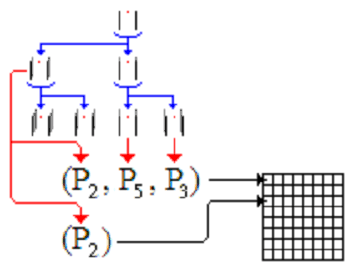

*DP - SLAM*

DP-SLAM,
yer işaretleri olmadan eş zamanlı lokalizasyon ve haritalama yapmayı amaçlar. DP-SLAM, bir döngü kapatıldığında haritaları düzelten tekniklerle uyumlu olsa da, çoğu durumda özel döngü kapatma tekniklerine sensör verisi üzerinden sadece tek bir geçiş yapar.

DP-SLAM, haritalar üzerinde ortak olasılık dağılımı koruyarak çalışır ve robot bir partikül filtresi kullanarak poz verir. Bu DP-SLAM' in, belirsizlikler çözülene kadar birden fazla zaman adımında haritayla ilgili belirsizliği korumasına olanak tanır. Bu harita üzerindeki hataların zamanla birikmesini önler.

*DP – Slam Nasıl Çalışır?*

DP-SLAM, haritalar ve robot pozisyonları üzerinde ortak olasılık dağılımını korumak için bir parçacık filtresi kullanır. Bu, bazı zeki veri yapıları olmaksızın pahalıdır, çünkü her parçacık için tüm doluluk ızgarasının tam bir kopyasını, ve parçacık filtresinin yeniden örnekleme safhasında haritaların kopyalarını çıkarmak gerekir. Aşağıdaki şekil, kavramsal olarak parçacıkların kökünü ve harita güncellemelerini gösterir.

Ancestry (soy) ağacındaki her bir kırmızı noktayı örneklenmiş bir robot pozisyonu ve kırmızı noktanın etrafındaki siyah çizgiler şu anki robot pozisyonuyla ilişkili yeni gözlemler olarak düşünülebilir. Gri çizgiler, önceki parçacıktan miras alınan haritanın parçasını gösterir.

image::images/maps.png[] 

İki en soldaki harita, kökün sol çocuğunun gözlemleri üzerinde anlaşmaya varırken, en sağdaki iki harita, sağ kök çocuğunun gözlemleriyle aynı fikirde olacaktır. Bir parçacık yeniden örneklendiğinde, bu harita bölümlerini saklamak ve tekrar tekrar kopyalamak bellek ve zaman kaybı olur. Bunu yerine her karede bir gözlem ağacı saklamak için tek bir doluluk ızgarasını kullanırız. Aşağıda gösterildiği gibi, her parçacık gözlemlerini genel ızgaraya ekler. Bunlar, dengeli bir ağaç olarak depolanır ve her parçacığa atanan benzersiz bir kimlik dizinine yerleştirilir.

*Algoritma ve Analizi*

Her bir parçacık harita ve robotun harita içindeki konumu ve yönü hakkında belirgin bir hipoteze karşılık gelir. Haritalarımız M kareden oluşan ızgaralardır. Parçacık filtresi P parçacıklarını muhafaza ederse, bu dağıtımı koruyan bir parçacık filtresinin naif bir uygulaması yineleme başına O(MP) maliyetli iş gerektirir.
Oluşturacağımız ağacı düğüm ekleyip silerek korumak için O(APlogP) zamana ihtiyaç vardır.  A, lazer tarafından silinen ızgaralı karelerin sayısıdır. 
Aşağıdaki şekilde D-P Slam algoritmasının pseudo kodu gösterilmiştir.

image::images/sahtekod.PNG[]

Buna göre, soy ağacını asgari seviyede tutmak istiyoruz. Soy ağacı boyutunu en aza indirgemek için ilk ve en önemli adım, tekrar edecek şekilde çocukları olmayan düğümleri bularak budamaktır. Budama aşamasından sonra, yalnızca bir çocuğa sahip parent ve child düğümleri birleştirerek, üst düğümleri daraltıyoruz. Bu işlem tamamlandığında, ağacın her dalı haritadaki farklı güncelleme kümelerine karşılık gelecektir.
Lokalizasyon için, her parçacığın tüm gözlem setini dikkate alması ve bunları bu noktaya kadar oluşturduğu haritayla karşılaştırması gerekir.  Soy ağacının D derinliğine sahip olduğunu varsayalım. Her bir sorgu maliyeti O(logP), toplam maliyet O(ADPlogP) olur.
Geliştirilmiş arama algoritmasında, ağacın i. seviyesinde 2^i tane ikili arama yapılır. Ağacın, D seviyesindeki toplam çalışma maliyeti şu şekildedir:

image::images/formul1.PNG[]

Lokalizasyon için toplam karmaşıklı O(AP(D + Dlog( P/D))) olur. En kötü durumda D P’ye yaklaşır ve karmaşıklık O(AP^2) olur.

Harita temsili ve gözlem modelinde, birikimli (kümülativ) olasılık Pc(x,p) olmak üzere şu şekilde hesaplanır:

image::images/formul2.PNG[]

Burada x mesafeyi, p ortam tipini, k bölünme sayısını ifade eder.

Lazer atışının n'ye kadar olan kareler tarafından kesilen kümülatif olasılığı şu şekilde ifade edilir:

Lazerin kare j-1 değerine ulaşıp sonra j noktasında durma ihtimali şu şekildedir:

*Kaynak Kodların Çalıştırılması*

DP-Slam algoritmasını çalıştırabilmemiz için şu adımları izlememiz gerekmektedir:

*1)* İlk olarak https://www.openslam.org/dpslam.html linkinden DP-Slam algoritmasının kaynak kodlarının indirmeliyiz.
*Alternetif Link:* https://github.com/jordant0/DP-SLAM

*2)* Algoritmayı çalıştırabilmemiz için linux işletim sistemine ihtiyacımız vardır. Linux işletim sistemini sanal makine üzerinde çalıştırabiliriz. Linux işletim sistemini çalıştırabilmemiz için,

a) https://www.virtualbox.org/wiki/Downloads ,adresinden sanal makine indirilerek, kurulumu yapılır.

b) Daha sonra http://wiki.ros.org/turtlebot/Tutorials/indigo/ISO%20Installation , adresinden içerisinde Ros' un da bulunduğu Ununtu 14.04 Ros İndigo indirilerek, kurulumu yapılır.

*Not:* Alternatif olarak https://www.ubuntu.com/download/desktop , adresinden Ubuntu 16.04 sürümüde indirilerek kurulumu yapılabilir. Fakat bu sürümde Ros bulunmadığından dolayı, http://yapbenzet.kocaeli.edu.tr/ros-kurulumu/ adresindeki adımlar takip edilerek kurulumu yapılmalıdır.
     
*3)* Yukarıdaki adımlar tamamlandıktan sonra, Rosbag kurulumu yapılır.

      sudo apt-get update
      sudo apt-get install python-rosbag

*Rosbag Nedir?*

Bir komut satırı aracıdır. Robot hareket ederken yayınlanan mesajları kaydedebilmekte ve daha sonra bu mesajları oynatabilmektedir. Bu sayede robot çalıştırılmadan bag dosyası üzerinden testler yapılabilmektedir. Diğer bir yandan farklı algoritmaların aynı ortamda karşılaştırılmasında, robot her bir algoritmanın 33 uygulanması sırasında alanı tekrar gezmesi gerekecektir. Bu durum her ne kadar gayret edilse de robotun aynı alanı aynı şekilde ufak farklılıklarla bile olsa gezememesine yol açacaktır. Ve karşılaştırma yapılan örnekler farklı olduğundan net sonuca ulaşılamayabilir. Oysaki gezilen alanın verilerinin toplandığı mesajlar bir bag dosyasına kaydedildiğinde her bir algoritma için aynı veri kullanılabilmektedir. Bu yöntem hem pratiklik sağlamakta hem de karşılaştırma doğruluğunu arttırmaktadır.

*4)* Imagemagick kurulumu yapılır.

      sudo apt-get update
      sudo apt-get install imagemagick

*Imagemagick Nedir?*

ada, c, ch, com+, c++, java, lisp, neko, .net, pascal, perl, php, python, ruby, tcl/tk dilleri ve/veya platformları için eklentileri bulunan, bunlarla da istenirse kullanılabilen bir yazılım.
kısaca elinden gelenler;

* format çevirme:bir görüntü formatından diğerine çevrim mesela (png to jpeg)

* image çevirme: bir image üzerinde resize, rotate, crop, flip veya trim 

* özel effectler: blur, sharpen, threshold, tint 

* text &amp; comments: image üzerine text ekleme

* image identification: herhangi bir image ın özelliklerini ve formatını tanımlama

* büyük resim desteği: mega- veya giga-pixel imagelar üzerinde okuma, işleme, yazma

*5)* İndirdiğimiz dosyaları biz "Belgelerim" altında "DP-SLAM" klasörünün içine attık, bundan dolayı dosya yolu şu şekilde  belirlemeliyiz.

      cd Belgeler
      cd DP-SLAM
      cd dp-slam
      
*6)* Makefile  dosyası derlenmelidir.

      make

*7)* odometry verileri okunmalıdır.

      ./slam -p scan_data.log -- Bu bizim edindiğimiz bir veri dosyası
      ./slam -p loop5.log

*Not:* Bu adımdaki işlem sırasında "bash: ./slam:Erişim engellendi" hatası alabiliriz bunu düzeltmek için,

       sudo chmod -R 755 ./slam

*Algoritmanın Kodsal Karşılığı*

Algoritmanın main Slam loop kodu şu şekildedir:

          // Main slam loop                    
          void HighSlam(TPath *path, TSenseLog *obs){
            int i, j;
            char name[16];
            HighInitializeFlags();
            if (h_curGeneration == 0) {
              HighAddToWorldModel(path, obs, 1);
              sprintf(name, "hmap00");
              HighPrintMap(name, h_particle[0].ancestryNode);
              sprintf(name, "rm hmap00.ppm");
              system(name);
            }
            else {
              // Localize off of the path
              HighLocalize(path, obs);
              HighUpdateAncestry(path, obs);
              if ((H_VIDEO) && (h_curGeneration % H_VIDEO == 0)) {
                sprintf(name, "hmap%.2d", (int) (h_curGeneration/H_VIDEO));
                j = 0;
                for (i = 0; i < h_cur_particles_used; i++)
            if (h_particle[i].probability > h_particle[j].probability)
              j = i;
                HighPrintMap(name, h_particle[j].ancestryNode);
                sprintf(name, "rm hmap%.2d.ppm", (int) (h_curGeneration/H_VIDEO));
                system(name);
              } }
            h_curGeneration++;
            HighInitializeFlags();}
                          CloseLowSlam();
                          return NULL;
                        }

Haritaları üretmek ve korumak için kod:

            #include <sys/types.h>
            #include <sys/stat.h>
            #include <fcntl.h>
            #include <sys/wait.h>
            #include <math.h>
            #include <strings .h>
            #include <string.h>
            #include <stdlib.h>
            #include <stdio.h>
            #include "lowMap.h"
            #define L_PRIOR (-1.0/(MAP_SCALE*8.0))
            #define L_PRIOR_DIST 4.0
            PMapStarter lowMap[MAP_WIDTH][MAP_HEIGHT];
            TAncestor l_particleID[ID_NUMBER];
            // Our current set of particles being processed by the particle filter
            TParticle l_particle[PARTICLE_NUMBER];
            // We like to keep track of exactly how many particles we are currently using.
            int l_cur_particles_used;
            int FLAG;
            void LowInitializeFlags(){
              while (observationID > 0) {
                observationID--;
                flagMap[obsX[observationID]][obsY[observationID]] = 0;
                obsX[observationID] = 0;
                obsY[observationID] = 0;
              }observationID = 1;}
            void LowInitializeWorldMap(){
              int x, y;
              for (y=0; y < MAP_HEIGHT; y++)
                for (x=0; x < MAP_WIDTH; x++) {
                  // The map is a set of pointers. Null represents that it is unobserved.
                  lowMap[x][y] = NULL;
                  // flagMap is set to all zeros, indicating that location does not have an
                  // entry in the observationArray
                  flagMap[x][y] = 0;
                }
              // There are no entries in the observationArray yet, so obsX/obsY are set to 0
              for (x=0; x < AREA; x++) {
                obsX[x] = 0;
                obsY[x] = 0;
              }
              // observationArray[0] is reserved as a constant for "unused". We start the
              // array at 1.
              observationID = 1;
            }
            void LowDestroyMap()
            {
              int x, y;
              // Get rid of the old map.
              for (y=0; y < MAP_HEIGHT; y++)
                for (x=0; x < MAP_WIDTH; x++) {
                  while (lowMap[x][y] != NULL) {
              free(lowMap[x][y]->array);
              free(lowMap[x][y]);
              lowMap[x][y] = NULL;
              }}}
            void LowResizeArray(TMapStarter *node, int deadID){
              short int i, j, ID, x, y;
              short int hash[ID_NUMBER];
              int source, last;
              TMapNode *temp;
              // observations leads to a reduction in the size of a dynamic array.
              if (deadID >= 0)
                node->dead++;
              node->size = (int)(ceil((node->total - node->dead)*1.75));
              temp = (TMapNode *) malloc(sizeof(TMapNode)*node->size);
              if (temp == NULL) fprintf(stderr, "Malloc failed in expansion of arrays.  %d\n", node->size);
              // Initialize our hash table.
              for (i=0; i < ID_NUMBER; i++)
                hash[i] = -1;
              j = 0;
              // Run through each entry in our old array of observations.
              for (i=0; i < node->total; i++) {
                if (node->array[i].ID == deadID) {
                  l_particleID[deadID].mapEntries[node->array[i].source].node = -1;}
                // This observation is the first one of this ID entered into the new array. Just copy it over, and note its position.
                else if (hash[node->array[i].ID] == -1) {
                  // Copy the information into the new array.
                  temp[j].ID = node->array[i].ID;
                  temp[j].source = node->array[i].source;
                  temp[j].parentGen = node->array[i].parentGen;
                  temp[j].hits = node->array[i].hits;
                  temp[j].distance = node->array[i].distance;
                  // This entry is moving- alter its source to track it
                  l_particleID[ temp[j].ID ].mapEntries[ temp[j].source ].node = j;
                  // Note that an observation with this ID has already been entered into the new array, and where that was entered.
                  hash[node->array[i].ID] = j;
                  j++;}
                else if (node->array[i].distance > temp[hash[node->array[i].ID]].distance) {
                  // We set a couple of values to shorter variable names, in order to reduce indirection and make 
                  // reading the code easier.
                  ID = node->array[i].ID;   // The ID of the observations in conflict.
                  source = temp[hash[ID]].source;  // The ancestor node corresponding to that ID
                  // Remove the source of the dead entry
                  l_particleID[ID].total--;
                  last = l_particleID[ID].total;
                  l_particleID[ID].mapEntries[source].x = l_particleID[ID].mapEntries[last].x;
                  l_particleID[ID].mapEntries[source].y = l_particleID[ID].mapEntries[last].y;
                  l_particleID[ID].mapEntries[source].node = l_particleID[ID].mapEntries[last].node;
                  x = l_particleID[ID].mapEntries[source].x;
                  y = l_particleID[ID].mapEntries[source].y;
                  if ((lowMap[x][y] == node) && (l_particleID[ID].mapEntries[source].node < i))
              temp[hash[ID]].source = source;
                  else
              lowMap[x][y]->array[ l_particleID[ID].mapEntries[source].node ].source = source;
                  // Copy the more recent information into the slot previously held by the dead entry
                  temp[hash[ID]].source = node->array[i].source;
                  temp[hash[ID]].hits = node->array[i].hits;
                  temp[hash[ID]].distance = node->array[i].distance;
                  l_particleID[ID].mapEntries[ node->array[i].source ].node = hash[ID];}
                else {
                  // The new entry is an older form of the one already entered. We should inherit the new parentGen
                  if (node->array[i].parentGen != -1)
              temp[hash[node->array[i].ID]].parentGen = node->array[i].parentGen;
                  ID = node->array[i].ID;
                  source = node->array[i].source;
                  // Remove the source of the dead entry
                  l_particleID[ID].total--;
                  last = l_particleID[ID].total;
                  if (last != source) {
              l_particleID[ID].mapEntries[source].x = l_particleID[ID].mapEntries[last].x;
              l_particleID[ID].mapEntries[source].y = l_particleID[ID].mapEntries[last].y;
              l_particleID[ID].mapEntries[source].node = l_particleID[ID].mapEntries[last].node;
              // A source entry was moved. Make sure that the observation it links to notes the new source position.
              x = l_particleID[ID].mapEntries[source].x;
              y = l_particleID[ID].mapEntries[source].y;
              if ((lowMap[x][y] == node) && (l_particleID[ID].mapEntries[source].node <= i))
                temp[hash[ID]].source = source;
              else
                lowMap[x][y]->array[ l_particleID[ID].mapEntries[source].node ].source = source;}
              node->total = j;
              node->dead = 0;
              free(node->array);
              node->array = temp;}  
            static void AddToWorkingArray(int i, TMapStarter *node, short int workingArray[]) {
              int j, source, last;
              TEntryList *entries;
              // Keep an eye out for dead entries. They will be made apparent when two entries both have the same ID.
              if (workingArray[node->array[i].ID] == -1) 
                workingArray[node->array[i].ID] = i;
              else {
                if (node->array[i].distance < node->array[ workingArray[node->array[i].ID] ].distance) {
                  // Otherwise, remove the source, then remove the entry. Follow with a recursive call.
                  j = i;
                  if (node->array[i].parentGen >= 0)
              node->array[ workingArray[node->array[i].ID] ].parentGen = node->array[i].parentGen;}
                // The previously entered entry is outdated. Replace it with this newer one.
                else {
                  j = workingArray[node->array[i].ID];
                  workingArray[node->array[i].ID] = i;
                  if (node->array[j].parentGen >= 0)
              node->array[i].parentGen = node->array[j].parentGen;}
                l_particleID[node->array[j].ID].total--;
                entries = l_particleID[node->array[j].ID].mapEntries;
                source = node->array[j].source;
                last = l_particleID[node->array[j].ID].total;
                if (last != source) {
                  entries[source].x = entries[last].x;
                  entries[source].y = entries[last].y;
                  entries[source].node = entries[last].node;
                  lowMap[ entries[source].x ][ entries[source].y ]->array[ entries[source].node ].source = source;}    
                node->total--;
                node->dead--;
                if (j != node->total) {
                  node->array[j].parentGen = node->array[node->total].parentGen;
                  node->array[j].distance = node->array[node->total].distance;
                  node->array[j].source = node->array[node->total].source;
                  node->array[j].hits = node->array[node->total].hits;
                  node->array[j].ID = node->array[node->total].ID;
                  l_particleID[ node->array[j].ID ].mapEntries[ node->array[j].source ].node = j;
                  if (workingArray[node->array[j].ID] == node->total)
              workingArray[node->array[j].ID] = j;
                  else if (i != node->total) 
              // Final step- add this newly copied node to the working array (we don't want it skipped over)
              AddToWorkingArray(j, node, workingArray);
              }}
            inline void LowBuildObservation(int x, int y, char usage){
              TAncestor *lineage;
              PAncestor stack[PARTICLE_NUMBER];
              short int workingArray[ID_NUMBER+1];
              int i, here, topStack;
              char flag;
              // The size of the observationArray is not large enough- we throw out an error
              // message and stop the program
              if (observationID >= AREA) 
                fprintf(stderr, "aRoll over!\n");
              // Grab a slot in the observationArray
              flagMap[x][y] = observationID;
              obsX[observationID] = x;
              obsY[observationID] = y;
              observationID++;
              here = flagMap[x][y];
              // Initialize the slot and the ancestor particles
              for (i=0; i < ID_NUMBER; i++) {
                observationArray[here][i] = -1;
                workingArray[i] = -1;
                l_particleID[i].seen = 0;}
              for (i=0; i < lowMap[x][y]->total; i++) 
                AddToWorkingArray(i, lowMap[x][y], workingArray);
              if (usage) {
                flag = 1;
                for (i=0; i < lowMap[x][y]->total; i++) 
                  if (lowMap[x][y]->array[i].hits > 0) 
              flag = 0;
                  else
              workingArray[lowMap[x][y]->array[i].ID] = -2;}
              // Fill in the holes in the observation array, by using the value of their parents
              for (i=0; i < l_cur_particles_used; i++) {
                lineage = l_particle[i].ancestryNode;
                topStack = 0;
                while ((lineage != NULL) && (lineage->seen == 0)) {
                  // put this ancestor on the stack to look at later
                  stack[topStack] = lineage;
                  topStack++;
                  // Note that we already have seen this ancestor, for later lineage searches
                  lineage->seen = 1;
                  lineage = lineage->parent;  // Advance to this ancestor's parent }
                while (topStack > 0) {
                  topStack--;
                  lineage = stack[topStack];
                  if ((workingArray[lineage->ID] == -1) && (lineage->parent != NULL)) {
              workingArray[lineage->ID] = workingArray[lineage->parent->ID];
              if (workingArray[lineage->ID] == -1) 
                flag = 0;
               }}
              if ((usage) && (flag)) 
                flagMap[x][y] = -2;
              else
                for (i=0; i < ID_NUMBER; i++) 
                  observationArray[here][i] = workingArray[i];}
            void LowUpdateGridSquare(int x, int y, double distance, int hit, int parentID){
              TEntryList *tempEntry;
              int here, i;
              if (lowMap[x][y] == NULL) {
                // Check to make sure there is still room left in the observation cache.
                if (observationID >= AREA) 
                  fprintf(stderr, "bRoll over!\n");
                // Display ownership of this slot
                flagMap[x][y] = observationID;
                obsX[observationID] = x;
                obsY[observationID] = y;
                observationID++;
                lowMap[x][y] = (TMapStarter *) malloc(sizeof(TMapStarter));
                if (lowMap[x][y] == NULL) fprintf(stderr, "Malloc failed in creation of Map Starter at %d %d\n", x, y);
                // No dead or obsolete entries yet.
                lowMap[x][y]->dead = 0;
                lowMap[x][y]->size = 1;
                lowMap[x][y]->array = (TMapNode *) malloc(sizeof(TMapNode));
                if (lowMap[x][y]->array == NULL) fprintf(stderr, "Malloc failed in making initial map array for %d %d\n", x, y);
                for (i=0; i < ID_NUMBER; i++) 
                  observationArray[flagMap[x][y]][i] = -1;}
              else if (flagMap[x][y] == 0) 
                LowBuildObservation(x, y, 0);
              here = observationArray[flagMap[x][y]][parentID];
              if ((here != -1) && (lowMap[x][y]->array[here].ID == parentID)) {
                lowMap[x][y]->array[here].hits = lowMap[x][y]->array[here].hits + hit;
                lowMap[x][y]->array[here].distance = lowMap[x][y]->array[here].distance + distance; }
              else {
                // We will be adding a new entry to the list- is there enough room?
                if (lowMap[x][y]->size <= lowMap[x][y]->total) {
                  LowResizeArray(lowMap[x][y], -71);
                  if (lowMap[x][y]->total == 0) {
              free(lowMap[x][y]->array);
              free(lowMap[x][y]);
              lowMap[x][y] = NULL; }}         
                observationArray[flagMap[x][y]][parentID] = lowMap[x][y]->total;   
                if (l_particleID[parentID].size == 0) {
                  l_particleID[parentID].size = 1;
                  l_particleID[parentID].mapEntries = (TEntryList *) malloc(sizeof(TEntryList));
                  if (l_particleID[parentID].mapEntries == NULL) fprintf(stderr, "Malloc failed in creation of entry list array\n");
                }
                else if (l_particleID[parentID].size <= l_particleID[parentID].total) {
                  l_particleID[parentID].size = (int)(ceil(l_particleID[parentID].total*1.25));
                  tempEntry = (TEntryList *) malloc(sizeof(TEntryList)*l_particleID[parentID].size);
                  if (tempEntry == NULL) fprintf(stderr, "Malloc failed in expansion of entry list array\n");
                  for (i=0; i < l_particleID[parentID].total; i++) {
              tempEntry[i].x = l_particleID[parentID].mapEntries[i].x;
              tempEntry[i].y = l_particleID[parentID].mapEntries[i].y;
              tempEntry[i].node = l_particleID[parentID].mapEntries[i].node;
                  }
                  free(l_particleID[parentID].mapEntries);
                  l_particleID[parentID].mapEntries = tempEntry;
                }
                l_particleID[parentID].mapEntries[l_particleID[parentID].total].x = x;
                l_particleID[parentID].mapEntries[l_particleID[parentID].total].y = y;
                l_particleID[parentID].mapEntries[l_particleID[parentID].total].node = lowMap[x][y]->total;
                i = lowMap[x][y]->total;
                lowMap[x][y]->array[i].source = l_particleID[parentID].total;
                lowMap[x][y]->array[i].ID = parentID;
                l_particleID[parentID].total++;
                if (here == -1) {
                  lowMap[x][y]->array[i].hits = hit;
                  lowMap[x][y]->array[i].distance = distance + L_PRIOR_DIST;
                  lowMap[x][y]->array[i].parentGen = -2; 
                }
                else {
                  lowMap[x][y]->array[i].hits = lowMap[x][y]->array[here].hits + hit;
                  lowMap[x][y]->array[i].distance = distance + lowMap[x][y]->array[here].distance;
                  lowMap[x][y]->array[i].parentGen = l_particleID[ lowMap[x][y]->array[here].ID ].generation;
                }
                lowMap[x][y]->total++;
              }
            }
            void LowDeleteObservation(short int x, short int y, short int node) {
              int total;
              if ((node == -1) || (lowMap[x][y] == NULL))
                return;
              if (lowMap[x][y]->total - lowMap[x][y]->dead == 1) {
                free(lowMap[x][y]->array);
                free(lowMap[x][y]);
                lowMap[x][y] = NULL;
                return;
              }
              if ((int)((lowMap[x][y]->total - 1 - lowMap[x][y]->dead)*2.5) <= lowMap[x][y]->size) {
                LowResizeArray(lowMap[x][y], lowMap[x][y]->array[node].ID);
                if (lowMap[x][y]->total == 0) {
                  free(lowMap[x][y]->array);
                  free(lowMap[x][y]);
                  lowMap[x][y] = NULL;
                }
                return;
              }
              lowMap[x][y]->total--;       
              total = lowMap[x][y]->total;
              if (node != lowMap[x][y]->total) {
                lowMap[x][y]->array[node].hits      = lowMap[x][y]->array[total].hits;
                lowMap[x][y]->array[node].distance  = lowMap[x][y]->array[total].distance;
                lowMap[x][y]->array[node].ID        = lowMap[x][y]->array[total].ID;
                lowMap[x][y]->array[node].source    = lowMap[x][y]->array[total].source;
                lowMap[x][y]->array[node].parentGen = lowMap[x][y]->array[total].parentGen;
                l_particleID[ lowMap[x][y]->array[node].ID ].mapEntries[ lowMap[x][y]->array[node].source ].node = node;
              }
            }   
            inline double LowComputeProbability(int x, int y, double distance, int parentID) 
            {
              if (lowMap[x][y] == NULL) 
                return (1.0 - exp(L_PRIOR * distance));       
              if (flagMap[x][y] == 0) 
                LowBuildObservation(x, y, 1);     
              if (flagMap[x][y] == -2)
                return 0;    
              if (observationArray[flagMap[x][y]][parentID] == -1)
                return (1.0 - exp(L_PRIOR * distance));    
              if (observationArray[flagMap[x][y]][parentID] == -2)
                return 0;
              if (lowMap[x][y]->array[ observationArray[flagMap[x][y]][parentID] ].hits == 0)
                return 0;
              return (1.0 - exp(-(lowMap[x][y]->array[ observationArray[flagMap[x][y]][parentID] ].hits/
                      lowMap[x][y]->array[ observationArray[flagMap[x][y]][parentID] ].distance) * distance));}
            double LowComputeProb(int x, int y, double distance, int ID){
              int i;
              if (lowMap[x][y] == NULL) 
                return UNKNOWN;
              while (1) {
                for (i=0; i < lowMap[x][y]->total; i++) {
                  if (lowMap[x][y]->array[i].ID == ID) {
              if (lowMap[x][y]->array[i].hits == 0)
                return 0;
              return (1.0 - exp(-(lowMap[x][y]->array[i].hits/lowMap[x][y]->array[i].distance) * distance));}}
                if (l_particleID[ID].parent == NULL)
                  return UNKNOWN;
                else 
                  ID = l_particleID[ID].parent->ID;}
              return UNKNOWN;}
            void LowAddTrace(double startx, double starty, double MeasuredDist, double theta, int parentID, int addEnd) {
              double overflow, slope; // Used for actually tracing the line
              int x, y, incX, incY, endx, endy;
              int xedge, yedge;      
              double dx, dy;
              double distance, error;
              double secant, cosecant;   // precomputed for speed
              secant = 1.0/fabs(cos(theta));
              cosecant = 1.0/fabs(sin(theta));
              distance = MIN(MeasuredDist, MAX_SENSE_RANGE);
              dx = (startx + (cos(theta) * distance));
              dy = (starty + (sin(theta) * distance));
              endx = (int) (dx);
              endy = (int) (dy);
              if (startx > dx) {
                incX = -1;
                xedge = 1}
              else {
                incX = 1;
                xedge = 0;}
              if (starty > dy) {
                incY = -1;
                yedge = 1;}
              else {
                incY = 1;
                yedge = 0;
              }
              if (fabs(startx - dx) > fabs(starty - dy)) {
                 y = (int) (starty);
                overflow =  starty - y;
                if (incY == 1)
                  overflow = 1.0 - overflow;
                slope = fabs(tan(theta));
                error = fabs(((int)(startx)+incX+xedge)-startx);
                overflow = overflow - (slope*error);
                if (overflow < 0.0) {
                  y = y + incY;
                  overflow = overflow + 1.0; }
                // Now we can start the actual line trace.
                for (x = (int) (startx) + incX; x != endx; x = x + incX) {
                  overflow = overflow - slope;
                  if (overflow < 0.0)
              distance = (overflow+slope)*cosecant;
                  else
              distance = fabs(slope)*cosecant;
                  LowUpdateGridSquare(x, y, distance, 0, parentID);
                  if (overflow < 0) {
              y = y + incY;
              distance = -overflow*cosecant;
              overflow = overflow + 1.0;
              LowUpdateGridSquare(x, y, distance, 0, parentID);} }
                // Update the last grid square seen as having a hit.
                if (addEnd) {
                  if (incX < 0)
              distance = fabs((x+1) - dx)*secant;
                  else
              distance = fabs(dx - x)*secant;
                  LowUpdateGridSquare(endx, endy, distance, 1, parentID);} }  
              else {
                x = (int) (startx);
                overflow = startx - x;
                if (incX == 1)
                  overflow = 1.0 - overflow;
                slope = 1.0/fabs(tan(theta));          
                error = fabs(((int)(starty)+incY+yedge)-starty);
                overflow = overflow - (error*slope);
                if (overflow < 0.0) {
                  x = x + incX;
                  overflow = overflow + 1.0;
                }
                for (y = (int) (starty) + incY; y != endy; y = y + incY) {
                  overflow = overflow - slope;
                  if (overflow < 0)
              distance = (overflow+slope)*secant;
                  else
              distance = fabs(slope)*secant;
                  LowUpdateGridSquare(x, y, distance, 0, parentID);
                  if (overflow < 0.0) {
              x = x + incX;
              distance = -overflow*secant;
              overflow = overflow + 1.0;
              LowUpdateGridSquare(x, y, distance, 0, parentID); } }
                if (addEnd) {
                  if (incY < 0)
              distance = fabs(((y+1) - dy)/sin(theta));
                  else
              distance = fabs((dy - y)/sin(theta));
                  LowUpdateGridSquare(endx, endy, distance, 1, parentID); } }
            double LowLineTrace(double startx, double starty, double theta, double MeasuredDist, int parentID, float culling) {
              double overflow, slope; // Used for actually tracing the line
              int x, y, incX, incY, endx, endy;
              double dx, dy;
              double totalProb; // Total probability that the line trace should have stopped before this step in the trace
              double eval;      // Total raw probability for the observation given this line trace through the map
              double prob, distance, error;
              double secant, cosecant;   // precomputed for speed
              double xblock, yblock;
              double xMotion, yMotion;
              double standardDist;
              // eval is the total probability for this line trace. Since this is a summation, eval starts at 0
              eval = 0.0;
              totalProb = 1.0;
              // a couple of variables are precomuted for speed.
              secant = 1.0/fabs(cos(theta));
              cosecant = 1.0/fabs(sin(theta));
              if (culling)
                distance = MeasuredDist+culling;
              else
                distance = MIN(MeasuredDist+20.0, MAX_SENSE_RANGE);
              // The endpoint of the scan, in both float and int.
              dx = (startx + (cos(theta) * distance));
              dy = (starty + (sin(theta) * distance));
              endx = (int) (dx);
              endy = (int) (dy);      
              if (startx > dx) {
                incX = -1;
                xblock = -startx; }
              else {
                incX = 1;
                xblock = 1.0-startx;}
              if (starty > dy) {
                incY = -1;
                yblock = -starty; }
              else {
                incY = 1;
                yblock = 1.0-starty; }
              // Two copies of the same basic code, swapping the roles of x and y, depending on which one is the primary 
              // direction of motion in the line trace.
              if (fabs(startx - dx) > fabs(starty - dy)) {
                y = (int) (starty);
                // The given starting point is non-integer. The line therefore starts at some point partially set in to the starting
                // square. Overflow starts at this off-center amount, in order to make steps in the y direction at the right places.
                overflow = starty - y;
                // Code is simpler if overflow is always decreasing towards zero. Note that slope is forced to be postive
                if (incY == 1) 
                  overflow = 1.0 - overflow;
                slope = fabs(tan(theta));
                if (slope > 1.0) 
                  slope = fabs((starty - dy) / (startx - dx));               
                dx = fabs((int)(startx)+xblock);
                dy = fabs(tan(theta)*dx);
                // The first step is actually in the y direction, due to the proximity of starty 
                // to the y axis. 
                if (overflow - dy < 0.0) {
                  y = y + incY;
                  overflow = overflow - dy + 1.0;}            
                else 
                  overflow = overflow - dy;            
                standardDist = slope*cosecant;         
                xMotion = -fabs(fabs(( ((int) (startx)) +xblock) * secant) - MeasuredDist);
                yMotion = -fabs(fabs((y+yblock) * cosecant) - MeasuredDist);
                for (x = (int) (startx) + incX; x != endx; x = x + incX) {
                  // Update our two running counts.
                  xMotion = xMotion + secant;
                  overflow = overflow - slope;      
                  if (overflow < 0.0) 
              distance = (overflow+slope)*cosecant;
                  else 
              distance = standardDist;
                  prob = totalProb * LowComputeProbability(x, y, distance, parentID);
                  if (prob > 0) {
              if (overflow < 0.0)
                error = fabs(yMotion);
              else
                error = fabs(xMotion);
              if (error < 20.0) 
                eval = eval + (prob * exp(-(error*error)/(2*LOW_VARIANCE)));
              totalProb = totalProb - prob;}
                  if (overflow < 0.0) {
              y += incY;
              yMotion = yMotion + cosecant;
              distance = -overflow*cosecant;
              overflow = overflow + 1.0;
              prob = totalProb * LowComputeProbability(x, y, distance, parentID);
              if (prob > 0) {        
                error = fabs(xMotion);
                if (error < 20.0) 
                  eval = eval + (prob * exp(-(error*error)/(2*LOW_VARIANCE)));
              }
              totalProb = totalProb - prob;}}}
              else {
                x = (int) (startx);
                overflow = startx - x;
                if (incX == 1)
                  overflow = 1.0 - overflow;
                slope = 1.0/fabs(tan(theta));
                // (See corresponding comments in the previous half of this function)
                dy = fabs((int)(starty)+yblock);
                dx = fabs(dy/tan(theta));
                if (overflow - dx < 0) {
                  x = x + incX;
                  overflow = overflow - dx + 1.0;}
                else 
                  overflow = overflow - dx;
                standardDist = slope*secant;
                xMotion = -fabs(fabs((x+xblock) * secant) - MeasuredDist);
                yMotion = -fabs(fabs(( ((int) (starty)) +yblock) * cosecant) - MeasuredDist);
                for (y = (int) (starty) + incY; y != endy; y = y + incY) {
                  yMotion = yMotion + cosecant;
                  overflow = overflow - slope;
                  if (overflow < 0.0) 
              distance = (overflow+slope)*secant;
                  else 
              distance = standardDist;
                  prob = totalProb * LowComputeProbability(x, y, distance, parentID);
                  if (prob > 0) {
              if (overflow < 0.0) 
                error = fabs(xMotion);
              else 
                error = fabs(yMotion);
              if (error < 20.0) 
                eval = eval + (prob * exp(-(error*error)/(2*LOW_VARIANCE)));}
                  totalProb = totalProb - prob;
                  if (overflow < 0.0) {
              x += incX;
              xMotion = xMotion + secant;
              distance = -overflow*secant;
              overflow = overflow + 1.0;
              prob = totalProb * LowComputeProbability(x, y, distance, parentID);
              if (prob > 0) {
                error = fabs(yMotion);
                if (error < 20.0) 
                  eval = eval + (prob * exp(-(error*error)/(2*LOW_VARIANCE))); }
              totalProb = totalProb - prob;}}}
              if (MeasuredDist >= MAX_SENSE_RANGE) 
                return (eval + totalProb);
              if (totalProb == 1)
                return 0;
              return (eval / (1.0 - totalProb));
             
             
*Örnek İnput ve Output*

image::images/in.PNG[]

image::images/c3.png[]
