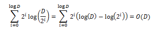

*DP - SLAM*

DP-SLAM,
yer işaretleri olmadan eş zamanlı lokalizasyon ve haritalama yapmayı amaçlar. DP-SLAM, bir döngü kapatıldığında haritaları düzelten tekniklerle uyumlu olsa da, çoğu durumda özel döngü kapatma tekniklerine sensör verisi üzerinden sadece tek bir geçiş yapar.

DP-SLAM, haritalar üzerinde ortak olasılık dağılımı koruyarak çalışır ve robot bir partikül filtresi kullanarak poz verir. Bu DP-SLAM' in, belirsizlikler çözülene kadar birden fazla zaman adımında haritayla ilgili belirsizliği korumasına olanak tanır. Bu harita üzerindeki hataların zamanla birikmesini önler.

*DP – Slam Nasıl Çalışır?*

DP-SLAM, haritalar ve robot pozisyonları üzerinde ortak olasılık dağılımını korumak için bir parçacık filtresi kullanır. Bu, bazı zeki veri yapıları olmaksızın pahalıdır, çünkü her parçacık için tüm doluluk ızgarasının tam bir kopyasını, ve parçacık filtresinin yeniden örnekleme safhasında haritaların kopyalarını çıkarmak gerekir. Aşağıdaki şekil, kavramsal olarak parçacıkların kökünü ve harita güncellemelerini gösterir.

Ancestry (soy) ağacındaki her bir kırmızı noktayı örneklenmiş bir robot pozisyonu ve kırmızı noktanın etrafındaki siyah çizgiler şu anki robot pozisyonuyla ilişkili yeni gözlemler olarak düşünülebilir. Gri çizgiler, önceki parçacıktan miras alınan haritanın parçasını gösterir.

image::images/maps.png[] 

İki en soldaki harita, kökün sol çocuğunun gözlemleri üzerinde anlaşmaya varırken, en sağdaki iki harita, sağ kök çocuğunun gözlemleriyle aynı fikirde olacaktır. Bir parçacık yeniden örneklendiğinde, bu harita bölümlerini saklamak ve tekrar tekrar kopyalamak bellek ve zaman kaybı olur. Bunu yerine her karede bir gözlem ağacı saklamak için tek bir doluluk ızgarasını kullanırız. Aşağıda gösterildiği gibi, her parçacık gözlemlerini genel ızgaraya ekler. Bunlar, dengeli bir ağaç olarak depolanır ve her parçacığa atanan benzersiz bir kimlik dizinine yerleştirilir.

image::images/otree.png[]

*Algoritma ve Analizi*

Her bir parçacık harita ve robotun harita içindeki konumu ve yönü hakkında belirgin bir hipoteze karşılık gelir. Haritalarımız M kareden oluşan ızgaralardır. Parçacık filtresi P parçacıklarını muhafaza ederse, bu dağıtımı koruyan bir parçacık filtresinin naif bir uygulaması yineleme başına O(MP) maliyetli iş gerektirir.
Oluşturacağımız ağacı düğüm ekleyip silerek korumak için O(APlogP) zamana ihtiyaç vardır.  A, lazer tarafından silinen ızgaralı karelerin sayısıdır. 
Aşağıdaki şekilde D-P Slam algoritmasının pseudo kodu gösterilmiştir.

Buna göre, soy ağacını asgari seviyede tutmak istiyoruz. Soy ağacı boyutunu en aza indirgemek için ilk ve en önemli adım, tekrar edecek şekilde çocukları olmayan düğümleri bularak budamaktır. Budama aşamasından sonra, yalnızca bir çocuğa sahip parent ve child düğümleri birleştirerek, üst düğümleri daraltıyoruz. Bu işlem tamamlandığında, ağacın her dalı haritadaki farklı güncelleme kümelerine karşılık gelecektir.
Lokalizasyon için, her parçacığın tüm gözlem setini dikkate alması ve bunları bu noktaya kadar oluşturduğu haritayla karşılaştırması gerekir.  Soy ağacının D derinliğine sahip olduğunu varsayalım. Her bir sorgu maliyeti O(logP), toplam maliyet O(ADPlogP) olur.
Geliştirilmiş arama algoritmasında, ağacın i. seviyesinde 2^i tane ikili arama yapılır. Ağacın, D seviyesindeki toplam çalışma maliyeti şu şekildedir:

Lokalizasyon için toplam karmaşıklı O(AP(D + Dlog( P/D))) olur. En kötü durumda D P’ye yaklaşır ve karmaşıklık O(AP^2) olur.

Harita temsili ve gözlem modelinde, birikimli (kümülativ) olasılık Pc(x,p) olmak üzere şu şekilde hesaplanır:

image::images/formul2.PNG[]

Burada x mesafeyi, p ortam tipini, k bölünme sayısını ifade eder.

Lazer atışının n'ye kadar olan kareler tarafından kesilen kümülatif olasılığı şu şekilde ifade edilir:

image::images/formul3.PNG[]

Lazerin kare j-1 değerine ulaşıp sonra j noktasında durma ihtimali şu şekildedir:

image::images/formul4.PNG[]

*Kaynak Kodların Çalıştırılması*

İlk olarak sanal makinede linux kurulumu yaplması gerekmektedir. Daha sonra ise linux'a ROS kurulumu yapılmıştır. Bu işlemleri yaptıktan sonra Dp-Slam algoritmasını çalıştırmamız için şu adımları izlemeliyiz:

ilk olarak segway base ve hokuyo laser'i çalıştırmalıyız. Bunları segbot_bringup kullanılarak yapılabiliriz,

  $ roslaunch segbot_bringup segbot_hokuyo.launch
 
Bundan sonra bir dosyanın içine robot sürüş halindeyken odom ve tarama verilerini kayıt edin,
  
  $ rosbag record -O dpslam.bag /scan /odom

Ardından logger, konuların verilerini okuyabilir Sonra bunları gereken biçimde bir dosyaya yazabilir,

  $ rosrun dpslam_logger dpslam.bag

Üretilen günlük dosyası daha sonra kopyalanabilir ve dpslam klasöründe çalıştırılabilir,

  $ cd ../dpslam
  $ make
  $ ./slam -p scan_data.log
  
Ortak ilişkili değişkenler: 

- dpslam/map.h:	PARTICLE_NUMBER: Düşük seviye işlem için kullanılan parçacık sayısını değiştirmeliyiz.

- H_PARTICLE_NUMBER: Yüksek seviye işlem için kullanılan parçacık sayısını değiştirmeliyiz.

- MAP_WIDTH and MAP_HEIGHT: Çıktısı düşük haritaların boyutunu değiştirme.

- H_MAP_WIDTH and H_MAP_HEIGHT: Çıktısı yüksek haritaların boyutunu değiştirme.

- dpslam/basic.h: Harita çözünürlüğünde metre başına kılavuz kareler sayısı değiştirilebilir. Tipik olarak 20-35 (ızgara karesi başına 3-5cm)

- dpslam/low.h: Her yüksek seviye yinelemesinden önce gerçekleştirilen düşük seviye iterasyon sayısını değiştirlebilir.

