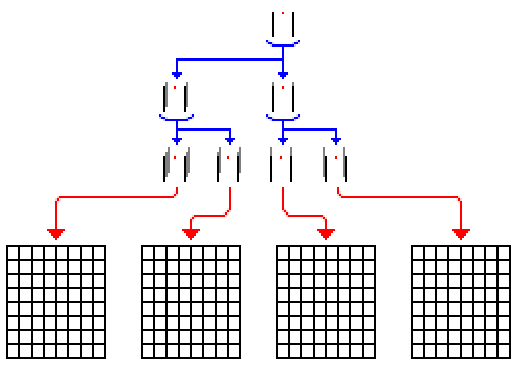
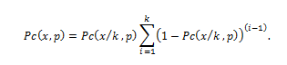
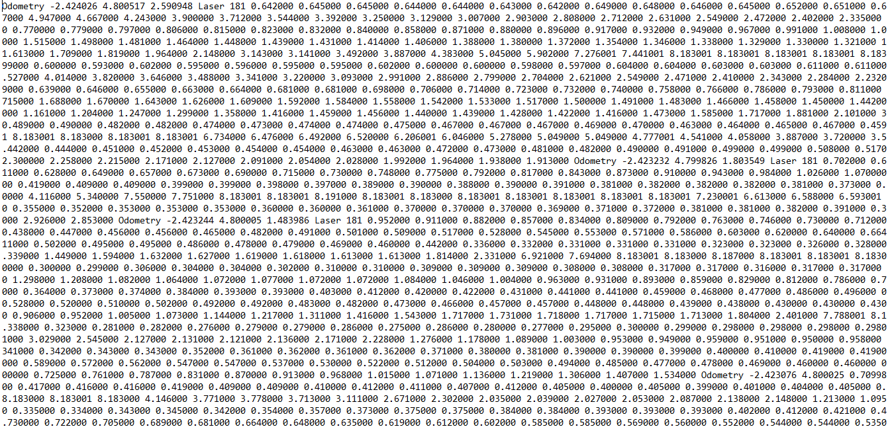
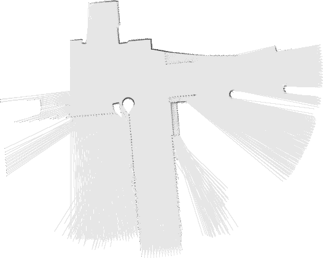

### DP - SLAM

DP-SLAM,
yer işaretleri olmadan eş zamanlı lokalizasyon ve haritalama yapmayı amaçlar. DP-SLAM, bir döngü kapatıldığında haritaları düzelten tekniklerle uyumlu olsa da, çoğu durumda özel döngü kapatma tekniklerine sensör verisi üzerinden sadece tek bir geçiş yapar.

DP-SLAM, haritalar üzerinde ortak olasılık dağılımı koruyarak çalışır ve robot bir partikül filtresi kullanarak poz verir. Bu DP-SLAM' in, belirsizlikler çözülene kadar birden fazla zaman adımında haritayla ilgili belirsizliği korumasına olanak tanır. Bu harita üzerindeki hataların zamanla birikmesini önler.

### DP – Slam Nasıl Çalışır?

DP-SLAM, haritalar ve robot pozisyonları üzerinde ortak olasılık dağılımını korumak için bir parçacık filtresi kullanır. Bu, bazı zeki veri yapıları olmaksızın pahalıdır, çünkü her parçacık için tüm doluluk ızgarasının tam bir kopyasını, ve parçacık filtresinin yeniden örnekleme safhasında haritaların kopyalarını çıkarmak gerekir. Aşağıdaki şekil, kavramsal olarak parçacıkların kökünü ve harita güncellemelerini gösterir.

Ancestry (soy) ağacındaki her bir kırmızı noktayı örneklenmiş bir robot pozisyonu ve kırmızı noktanın etrafındaki siyah çizgiler şu anki robot pozisyonuyla ilişkili yeni gözlemler olarak düşünülebilir. Gri çizgiler, önceki parçacıktan miras alınan haritanın parçasını gösterir.

 

İki en soldaki harita, kökün sol çocuğunun gözlemleri üzerinde anlaşmaya varırken, en sağdaki iki harita, sağ kök çocuğunun gözlemleriyle aynı fikirde olacaktır. Bir parçacık yeniden örneklendiğinde, bu harita bölümlerini saklamak ve tekrar tekrar kopyalamak bellek ve zaman kaybı olur. Bunu yerine her karede bir gözlem ağacı saklamak için tek bir doluluk ızgarasını kullanırız. Aşağıda gösterildiği gibi, her parçacık gözlemlerini genel ızgaraya ekler. Bunlar, dengeli bir ağaç olarak depolanır ve her parçacığa atanan benzersiz bir kimlik dizinine yerleştirilir.

 

### Algoritma ve Analizi

Her bir parçacık harita ve robotun harita içindeki konumu ve yönü hakkında belirgin bir hipoteze karşılık gelir. Haritalarımız M kareden oluşan ızgaralardır. Parçacık filtresi P parçacıklarını muhafaza ederse, bu dağıtımı koruyan bir parçacık filtresinin naif bir uygulaması yineleme başına O(MP) maliyetli iş gerektirir.
Oluşturacağımız ağacı düğüm ekleyip silerek korumak için O(APlogP) zamana ihtiyaç vardır.  A, lazer tarafından silinen ızgaralı karelerin sayısıdır. 
Aşağıdaki şekilde D-P Slam algoritmasının pseudo kodu gösterilmiştir.

Buna göre, soy ağacını asgari seviyede tutmak istiyoruz. Soy ağacı boyutunu en aza indirgemek için ilk ve en önemli adım, tekrar edecek şekilde çocukları olmayan düğümleri bularak budamaktır. Budama aşamasından sonra, yalnızca bir çocuğa sahip parent ve child düğümleri birleştirerek, üst düğümleri daraltıyoruz. Bu işlem tamamlandığında, ağacın her dalı haritadaki farklı güncelleme kümelerine karşılık gelecektir.
Lokalizasyon için, her parçacığın tüm gözlem setini dikkate alması ve bunları bu noktaya kadar oluşturduğu haritayla karşılaştırması gerekir.  Soy ağacının D derinliğine sahip olduğunu varsayalım. Her bir sorgu maliyeti O(logP), toplam maliyet O(ADPlogP) olur.
Geliştirilmiş arama algoritmasında, ağacın i. seviyesinde 2^i tane ikili arama yapılır. Ağacın, D seviyesindeki toplam çalışma maliyeti şu şekildedir:

Lokalizasyon için toplam karmaşıklı O(AP(D + Dlog( P/D))) olur. En kötü durumda D P’ye yaklaşır ve karmaşıklık O(AP^2) olur.

Harita temsili ve gözlem modelinde, birikimli (kümülativ) olasılık Pc(x,p) olmak üzere şu şekilde hesaplanır:

Burada x mesafeyi, p ortam tipini, k bölünme sayısını ifade eder.

Lazer atışının n'ye kadar olan kareler tarafından kesilen kümülatif olasılığı şu şekilde ifade edilir:

image::images/formul3.PNG[]

Lazerin kare j-1 değerine ulaşıp sonra j noktasında durma ihtimali şu şekildedir:

image::images/formul4.PNG[]

### Kaynak Kodların Çalıştırılması

DP-Slam algoritmasını çalıştırabilmemiz için şu adımları izlememiz gerekmektedir:

*1)* İlk olarak https://www.openslam.org/dpslam.html linkinden DP-Slam algoritmasının kaynak kodlarının indirmeliyiz.
*Alternatif Link:* https://github.com/jordant0/DP-SLAM

*2)* Algoritmayı çalıştırabilmemiz için linux işletim sistemine ihtiyacımız vardır. Linux işletim sistemini sanal makine üzerinde çalıştırabiliriz. Linux işletim sistemini çalıştırabilmemiz için,

a) https://www.virtualbox.org/wiki/Downloads ,adresinden sanal makine indirilerek, kurulumu yapılır.

b) Daha sonra https://www.ubuntu.com/download/desktop , adresinden Ubuntu 16.04 sürümüde indirilerek kurulumu yapılır.

*Not:* Alternatif olarak  http://wiki.ros.org/turtlebot/Tutorials/indigo/ISO%20Installation , adresinden Ununtu 14.04 Ros İndigo indirilerek, kurulumu yapılabilir.
  
  
*3)* Yukarıdaki adımlar tamamlandıktan sonra, Rosbag kurulumu yapılır.

      sudo apt-get update
      sudo apt-get install python-rosbag

### Rosbag Nedir?

Bir komut satırı aracıdır. Robot hareket ederken yayınlanan mesajları kaydedebilmekte ve daha sonra bu mesajları oynatabilmektedir. Bu sayede robot çalıştırılmadan bag dosyası üzerinden testler yapılabilmektedir. Diğer bir yandan farklı algoritmaların aynı ortamda karşılaştırılmasında, robot her bir algoritmanın 33 uygulanması sırasında alanı tekrar gezmesi gerekecektir. Bu durum her ne kadar gayret edilse de robotun aynı alanı aynı şekilde ufak farklılıklarla bile olsa gezememesine yol açacaktır. Ve karşılaştırma yapılan örnekler farklı olduğundan net sonuca ulaşılamayabilir. Oysaki gezilen alanın verilerinin toplandığı mesajlar bir bag dosyasına kaydedildiğinde her bir algoritma için aynı veri kullanılabilmektedir. Bu yöntem hem pratiklik sağlamakta hem de karşılaştırma doğruluğunu arttırmaktadır.

*4)* Imagemagick kurulumu yapılır.

      sudo apt-get update
      sudo apt-get install imagemagick

### Imagemagick Nedir?

ada, c, ch, com+, c++, java, lisp, neko, .net, pascal, perl, php, python, ruby, tcl/tk dilleri ve/veya platformları için eklentileri bulunan, bunlarla da istenirse kullanılabilen bir yazılım.
kısaca elinden gelenler;

* format çevirme:bir görüntü formatından diğerine çevrim mesela (png to jpeg)

* image çevirme: bir image üzerinde resize, rotate, crop, flip veya trim 

* özel effectler: blur, sharpen, threshold, tint 

* text &amp; comments: image üzerine text ekleme

* image identification: herhangi bir image ın özelliklerini ve formatını tanımlama

* büyük resim desteği: mega- veya giga-pixel imagelar üzerinde okuma, işleme, yazma

*5)* İndirdiğimiz dosyaları biz "Belgelerim" altında "DP-SLAM" klasörünün içine attık, bundan dolayı dosya yolu şu şekilde  belirlemeliyiz.

      cd Belgeler
      cd DP-SLAM
      cd dp-slam
     
     
*6)* Makefile  dosyası derlenmelidir.

      make

*7)* odometry verileri okunmalıdır.

      ./slam -p scan_data.log -- Bu bizim edindiğimiz bir veri dosyası
      ./slam -p loop5.log

*Not:* Bu adımdaki işlem sırasında "bash: ./slam:Erişim engellendi" hatası alabiliriz bunu düzeltmek için,

       sudo chmod -R 755 ./slam

*Not:* Bu adımda Dp-Slam klasörü içerisindeki loop5.log data seti kullanılabileceği gibi, https://github.com/jordant0/DP-SLAM, adresindeki scan_data.log isimli data setide kullanılabilir. Ek olarak https://users.cs.duke.edu/~parr/dpslam/, adresindeki "Sample Output" başlığı altındaki farklı data setleri de kullanılabilir. 

       

             
### Örnek İnput ve Output

